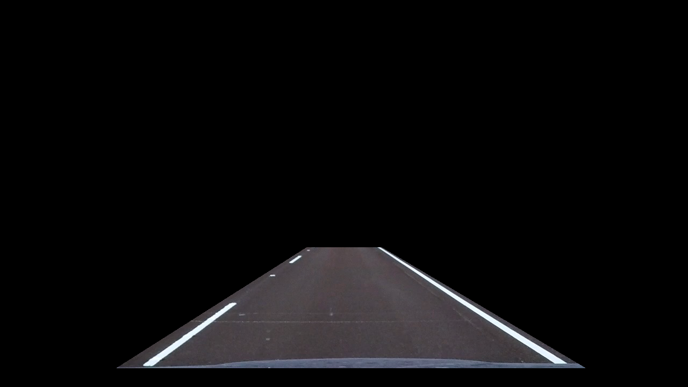

## Writeup Template

### You can use this file as a template for your writeup if you want to submit it as a markdown file, but feel free to use some other method and submit a pdf if you prefer.

---

**Advanced Lane Finding Project**

The goals / steps of this project are the following:

* Compute the camera calibration matrix and distortion coefficients given a set of chessboard images.
* Apply a distortion correction to raw images.
* Use color transforms, gradients, etc., to create a thresholded binary image.
* Apply a perspective transform to rectify binary image ("birds-eye view").
* Detect lane pixels and fit to find the lane boundary.
* Determine the curvature of the lane and vehicle position with respect to center.
* Warp the detected lane boundaries back onto the original image.
* Output visual display of the lane boundaries and numerical estimation of lane curvature and vehicle position.

[//]: # (Image References)

[image1]: ./examples/undistort_output.png "Undistorted"
[image2]: ./test_images/test1.jpg "Road Transformed"
[image3]: ./examples/binary_combo_example.jpg "Binary Example"
[image4]: ./examples/warped_straight_lines.jpg "Warp Example"
[image5]: ./examples/color_fit_lines.jpg "Fit Visual"
[image6]: ./examples/example_output.jpg "Output"
[video1]: ./project_video.mp4 "Video"

## [Rubric](https://review.udacity.com/#!/rubrics/571/view) Points

### Here I will consider the rubric points individually and describe how I addressed each point in my implementation.

---

### Writeup / README

#### 1. Provide a Writeup / README that includes all the rubric points and how you addressed each one.  You can submit your writeup as markdown or pdf.  [Here](https://github.com/udacity/CarND-Advanced-Lane-Lines/blob/master/writeup_template.md) is a template writeup for this project you can use as a guide and a starting point.

You're reading it!

### Camera Calibration

#### 1. Briefly state how you computed the camera matrix and distortion coefficients. Provide an example of a distortion corrected calibration image.

The code for camera matrix is in pipe.py `cam_calibration`.

I start by preparing "object points", which will be the (x, y, z) coordinates of the chessboard corners in the world. Here I am assuming the chessboard is fixed on the (x, y) plane at z=0, such that the object points are the same for each calibration image.  Thus, `objp` is just a replicated array of coordinates, and `objpoints` will be appended with a copy of it every time I successfully detect all chessboard corners in a test image.  `imgpoints` will be appended with the (x, y) pixel position of each of the corners in the image plane with each successful chessboard detection.

I then used the output `objpoints` and `imgpoints` to compute the camera calibration and distortion coefficients using the `cv2.calibrateCamera()` function.  I applied this distortion correction to the test image using the `cv2.undistort()`.

For examples of distortion, see sections below.

### Pipeline (single images)

#### 1. Provide an example of a distortion-corrected image.

To demonstrate this step, I will describe how I apply the distortion correction to one of the test images like this one:


Here is the undistored image using `cv2.undistort`


As can be clearly seen, the edges of the chessboard is now straight; this validates the undistortion step is completed correctly.


#### 2. Describe how (and identify where in your code) you used color transforms, gradients or other methods to create a thresholded binary image.  Provide an example of a binary image result.

I used a combination of color and gradient thresholds to generate a binary image.  The method of interest is in helper.py `edge_detection`.

Briefly, I first applied adaptive histogram normalization (clahe in opencv) to increase contrast; then I applied binary thresholding by retaing the 97 to 100 percentile pixels on red channel of RGB colorspace as well the saturation channel of the HLS colorspace.

Next, I applied both magnitude and direction sobel thresholding as suggested in the lectures.

Here's an example of my output for this step.  (note: this is not actually from one of the test images)


#### 3. Describe how (and identify where in your code) you performed a perspective transform and provide an example of a transformed image.

The perspective transform code live in helper2.py `bird_eye_view`.

I use a trapezoid region of interest from the first lane detection assignment and the source coordinate are as follows

```python
    h, w, _ = img.shape

    # source
    region = np.array([
        # top left
        (int(w / 2) - 100, int(h / 2) + 100),
        # top right
        (int(w / 2) + 100, int(h / 2) + 100),
        # bottom right
        (int(w * 0.8), int(h * 0.85)),
        # bottom left
        (int(w * 0.2), int(h * 0.85)),
    ])

    # destination
    dst_corners = np.array([(offset, offset), (w - offset, offset),
                            (w - offset, h - offset),
                            (offset, h - offset)]).astype('float32')
```

Here is an example demonstrating the region.


I verified that my perspective transform was working as expected by drawing by visualizing the warped images and that unwarped trapzoid aligns with lane correctly.


#### 4. Describe how (and identify where in your code) you identified lane-line pixels and fit their positions with a polynomial?

The actual lane detection code lives in helper2.py `detect_lane`.

This functions applies the histogram search as suggested in the lectures with some additional processing. Moreover, the `detect_lane` method attempts to reuse the fitted for lane search as long as the newly detected polynomial difference with last detected ones are not too big. This is a manually tuned threshold and is set at 20e3.


#### 5. Describe how (and identify where in your code) you calculated the radius of curvature of the lane and the position of the vehicle with respect to center.

The radius of curvature and position of vehicle are calculated as demonstrated in the lectures and live in line.py `curvature` and `base_x` respectively.

Briefly, I adopted the following conversion factors.

```
# Define conversions in x and y from pixels space to meters
ym_per_pix = 15 / 720  # meters per pixel in y dimension
xm_per_pix = 3.7 / 950 # meters per pixel in x dimension
```

I then calculated the curvature using the formulat provided from the fitted polynomial.

For video analysis, I kept the last 5 estimates after rejecting outliers to keep the curvature and vehicle position estimate smooth and sane.


#### 6. Provide an example image of your result plotted back down onto the road such that the lane area is identified clearly.

Here is an example of the lane detection pipe output.


---

### Pipeline (video)

#### 1. Provide a link to your final video output.  Your pipeline should perform reasonably well on the entire project video (wobbly lines are ok but no catastrophic failures that would cause the car to drive off the road!).

Here's a [link to my video result](test_videos_output/project_video.mp4)

---

### Discussion

#### 1. Briefly discuss any problems / issues you faced in your implementation of this project.  Where will your pipeline likely fail?  What could you do to make it more robust?

The main issues encountered in the project is the noise reduction from the binary thresholding. In many frames of the challenge and hard challenge videos, the simple colorspace thresholding does not produce clean result.

Further analysis technique such as morphological operations (https://docs.opencv.org/trunk/d9/d61/tutorial_py_morphological_ops.html) might be able to help.

Additionally, the project videos are during daylight conditions and sunny weather. The implemented algorithm will most likely fail to detect lanes properly in more extreme weather and lighting conditions.

These exercises are left for future research.
